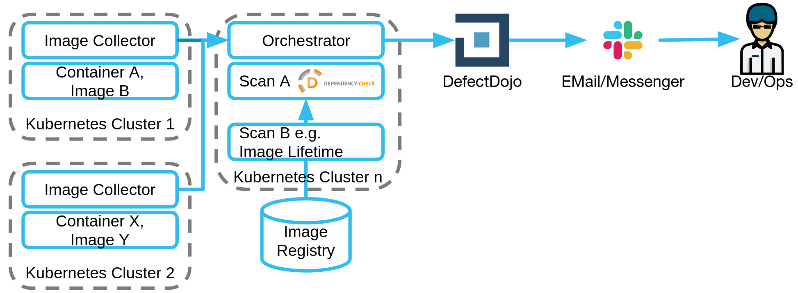

# Cluster Scanner

Discover vulnerabilities and container image misconfiguration in production environments.

# Introduction
The ClusterImageScanner detects images in a Kubernetes cluster and provides fast feedback based on various security tests. It is recommended to run the Cluster Scanner in production environments in order to get up-to-date feedback on security issues where they have real impact.

Since the ClusterImageScanner itself is a service running within your Kubernetes cluster you can re-use your existing deployment procedures.
# Overview
The following figure provides an overview:

The following steps are conducted.
1. The Image Collector, as the name suggests, collects the different images from a container environment like a kubernetes cluster. The Collector creates a JSON file and including information like the cluster, the responsible team, and image.
2. The Orchestrator (implemented via ArgoWorkflows) starts the workflow periodically (e.g. nightly)
3. The images from the Collector can be pulled by the Image Fetcher 
4. These files are kept in a separate directory and from there they are passed to the scanner
5. This scanner - which then receives the libraries to be ignored via the suppressions file - then executes the scans described in the definitions of Dependency Check, Lifetime, Virus and further more.
6. The vulnerability management system (in our case [OWASP DefectDojo](https://github.com/DefectDojo/django-DefectDojo)) then collects the results 
7. Non responded to findings are made available to the developers via a communication channel (Slack/Email).

## Documentation Table of Contents
- [User documentation](docs/user)
- [Architecture and Decisions](docs/architecture)
- [Operator documentation](docs/deployment)

[Video (English): SDA SE CluserImageScanner is going Open Source, 2021-03](https://www.youtube.com/watch?v=_AElSBKSizc&t=2966s)

# Images
Images to be used by ArgoWorkflows are published in quay.io (2021-06-28):

- `quay.io/sdase/clusterscanner-scan-dependency-check`
- `quay.io/sdase/clusterscanner-scan-runasroot`
- `quay.io/sdase/clusterscanner-scan-distroless`
- `quay.io/sdase/clusterscanner-scan-lifetime`
- `quay.io/sdase/clusterscanner-imagefetcher`
- `quay.io/sdase/clusterscanner-notifier`
- `quay.io/sdase/clusterscanner-imagecollector`
- `quay.io/sdase/clusterscanner-image-source-fetcher`
- `quay.io/sdase/clusterscanner-workflow-runner`
- [quay.io/sdase/defectdojo-client](https://github.com/SDA-SE/defectdojo-client)

`quay.io/sdase/clusterscanner-base` is the base for all `quay.io/sdase/clusterscanner-*` images.

Images are build with [buildah](https://buildah.io/). The env. parameters the image can be started with are documented via --config within the _build.sh_ scripts within the [images](images/).

# Contributing
We are looking forward to contributions. Take a look at our [Contribution Guidelines](CONTRIBUTING.md) before submitting Pull Requests.

# Responsible Disclosure and Security
The [SECURITY.md](SECURITY.md) includes information on responsible disclosure and security related topics like security patches.

# Legal Notice
The purpose of the ClusterImageScanner is not to replace the penetration testers or make them obsolete. We strongly recommend running extensive tests by experienced penetration testers on all your applications.
The ClusterScanner is to be used only for testing purpose of your running applications/containers. You need a written agreement of the organization of the _environment under scan_ to scan components with the ClusterScanner.

# Author Information
This project is developed by [Signal Iduna](https://www.signal-iduna.de) and [SDA SE](https://sda.se/). 
