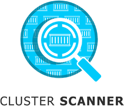

# Cluster Scanner

Discover vulnerabilities and container image misconfiguration in production environments.

# Introduction
The _Cluster Scanner_ detects images in Kubernetes clusters and provides fast feedback based on security tests.
It is recommended to run the Cluster Scanner in production environments.

As a developer, the Cluster Scanner works out of the box.
As a system operator, I just have to add the Cluster Scanner in my deployment configuration, for example Argo CD. The benefit is to get feedback on what is in production and not what should be in production. For example, due to waiting for approval or due to a failing build.

# Overview
In order to achieve an understanding of the cluster scanning process, this page uses a chart and detailed documentation to describe which factors are involved and in which way.
1. The Image Collector, as the name suggests, collects the different images.
2. These images can be passed to the Fetcher via the Cluster Scan, via the GitOps process, or manually. The Fetcher then converts the CSV files into JSON files and provides additional fields with information about clusters, teams and images.
3. These files are kept in a separate directory and from there they are passed to the scanner.
4. This scanner - which then receives the libraries to be ignored via the suppressions file - then executes the scans described in the definitions of Dependency Check, Lifetime, Virus and further more.
5. The vulnerability management system then collects the results and makes them available to the developers via Slack.
## Table of Contents

- [User documentation](docs/user)
- [Architecture and Decisions](docs/architecture)
- [Operator documentation](docs/deployment)