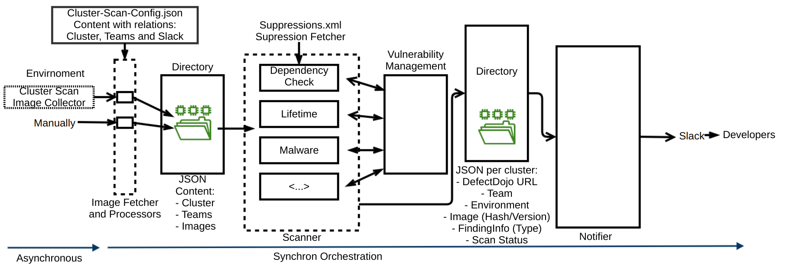

# Architecture
The detailed architecture is depicted in the following dataflow diagram:

The Fetcher is in detail documented in [Fetcher](fetcher.md).
The Collector is in detail documented in [Collector](collector.md).

The Architectural Decisions are documented:

- [Orchestration](decisions/architecture-orchestration.md)
- [Image Transfer](decisions/case-study-image-transfer.md)

The [threat model](threat-model.md) is documented.
