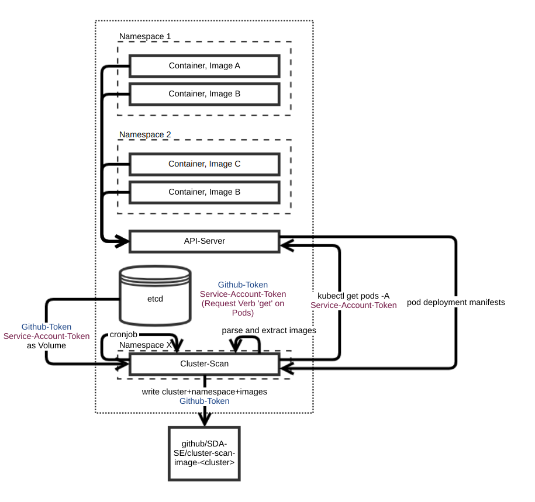

# ClusterScanner Image Collector
The fetcher “ClusterScanner Image Collector” fetches images from a cluster. This page presents the collection process and the threat model of the process.

The fetcher “ClusterScanner Image Collector” is deployed in a Kubernetes cluster and needs to have read access on all pods. Therefore, it has a high protection requirement and a threat model has been created.

## Solution Overview

The Cluster Scan Image Collector gets pods, parse the pod descriptions and, extracts namespaces and images, including image tags and hashes. Because mutable images (e.g. lastest) might be used, the image hash is gathered in case it is available. The image hash is not available for nonrunning cronjobs with history enabled. To get pods from within a container in a cluster, kubectl is used and defined in _entrypoint.bash_ like the following:
```
kubectl get pods -A -o json
```

The cluster scan pod needs to have a _ClusterRole_ with  read access to the resource pod. An example configuration is defined in the gitops-devops-tools cluster.

The ClusterScanner Image Collector pushes the used images into the defined target repository. An example entry in the pushed flat JSON is documented in [Github](https://github.com/SDA-SE/cluster-scan-test-images/).

