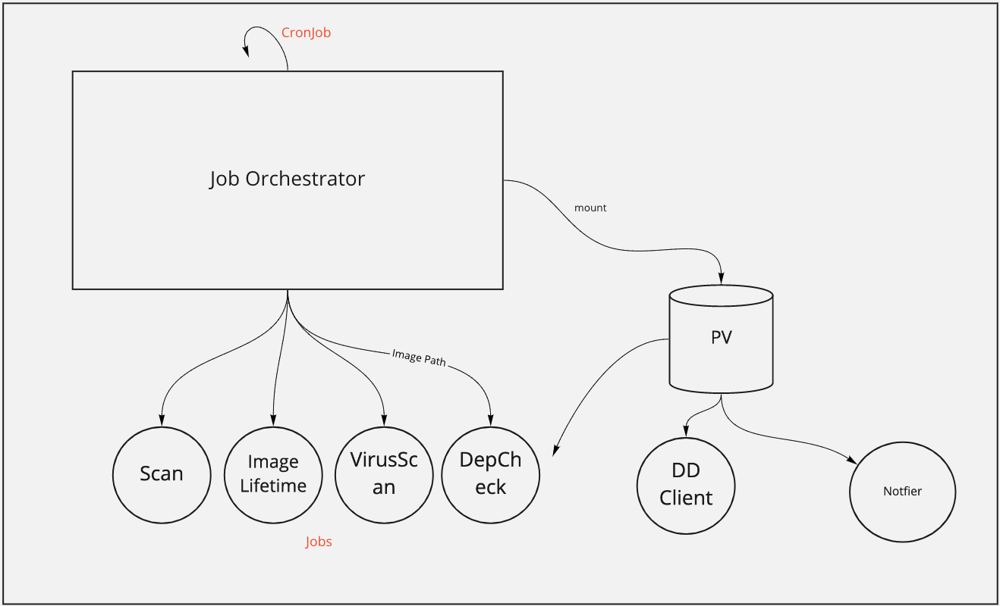
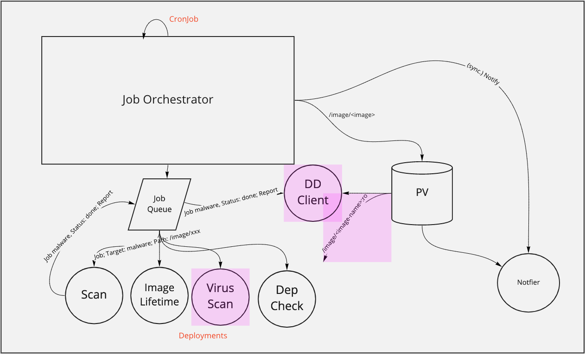
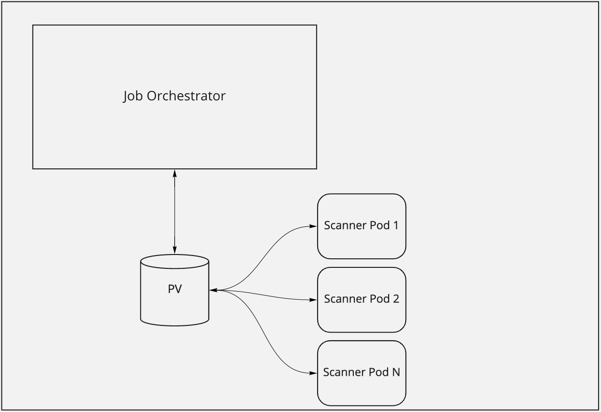
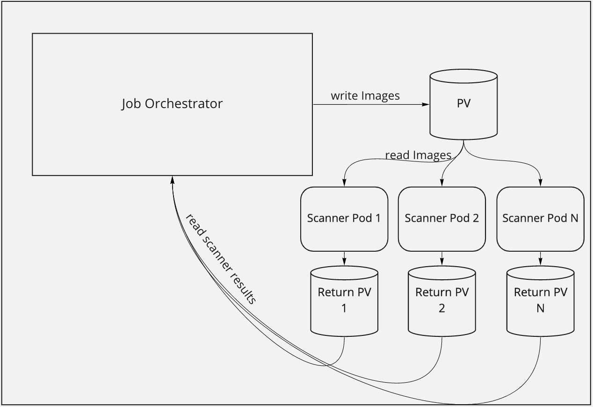

## Job-Orchestration Considerations

To transform the project into a microservice architecture we considered the following two possible ways.

### Approach A: Central Job-Orchestrator
This Approach is about building a central Job-Orchestrator that manages different scanners and scans as cluster-jobs. The orchestrator would be
started by a cronjob and would evaluate what work have to be done on what image, by a general configuration file and aspecific CSV-file extracted
from a specific git-repository. After evaluation of what jobs have to be done, it will provide the images to the PV and start a Kubernetes-job for each
scan and each image.

Example Job Matrix:

| Image\Scan   | GeneralScan | VirusScan | DependencyScan | ImageLifetime |
|--------------|-------------|-----------|----------------|---------------|
| ubuntu:20.04 |      x      |     x     |                |       x       |
| centos:8     |      x      |           |                |       x       |
| java-tool:12 |      x      |     x     |        x       |       x       |

This combination of images and scan-properties would cause 9 different jobs to be spawned in the scanner namespace. With a namespaced ResourceQuota it's
simple to define CPU/memory-limits or limit by parallel jobs.

General:
- Kubernetes is the queue

Pros:
- Orchestrator will define which scanner-image and version to start, provide appropriate runtime-parameters
- Updating: Updating the CronJob with a new Orchestrator-Version also upgrades used scanner-images
- Jobs can be restarted by Kubernetes if failed
- Jobs can have a maximum execution time

Cons:
- Orchestrator needs a ServiceAccount with verbs: create, delete, get for resource: jobs in own namespace
- Implementing Kubernetes as a Queue

### Approach B: Kafka Job Queue
This Approach is about building a Job-Generator that will be started by a CronJob that would evaluate what work have to be done on what image, by a general
configuration file and aspecific CSV-file extracted from a specific git-repository. After evaluation of what jobs have to be done, it will provide the
images to the PV and put a work-message to a specific Kafka queue.
All scanners will be permanently deployed by deployment with an attached Horizontal Pod Autoscaler that monitors the CPU-utilization and scales the
amount of parallel scanners accordingly to the utilization between a minimum and a maximum of parallel workers.
There will be a job queue for every known scanner-type and the auto-scaled scanners will take one job from the queue, process the job and put the result
back onto another queue to be processed further.

General:
- Kafka is the queue

Pros:
- First Scanner of each type is already started and don't need any warm-up.
- Spawned Scanner can be reused

Cons:
- Autoscaler will possibly start one more scanner of each type than needed. (5 Jobs are in Queue, 5 Scanner working under full load, auto-scaler add one more but there is no more job)
- Version mismatch possible between job-generator and scanners
- Implementing Kafka as a Queue
- Provide and maintain an appropriate Kafka-Deployment
- Customize and maintain external scanner images to stay alive and work off the Kafka-queue

### Final Dissicion

In the end, we decided to go for Approach A: Central Job-Orchestrator for the following reasons:

- it can be archived with less effort and therefor faster
- it also drives us towards the Kafka-Approach and if needed we can develop later into Approach B

As an engine, [ArgoWorkflow](https://argoproj.github.io/projects/argo/) is used.

## File-Transfer Considerations

This section is about the way data is transferred between the components of the cluster-vulnerability-scanner. Components are the Job-Orchestrator as a managing pod and all started scanners separately.

To transfer data between the different components Persistent-Volumes (PV) are expected to be the most native available and reliable approach.

### Approach A: One single PV
This Approach is about transferring images to scanners and results back to the Job-Orchestrator with on single PV.

Pros:
- Simple to deploy
- Can be referenced in Job-Orchestrator and every scanner
- Through subpathing, scanner components only write to a specific subpath
- Image-folder and result-folder are defined by k8s-job-description, this information is kept transparent for the specific job

Cons:
- When the volume gets full, every job will fail

### Approach B: Multiple PVs
This Approach is about transferring images to scanners with one PV that can be written by the Job-Orchestrator and red by all scanners. And separate PVs for all scanner-types to deliver scanning results back to the Job-Orchestrator.

Pros:
- Separated PVs for all components so a failure leads to a specific component

Cons:
- When one volume gets full, every job of that kind will fail
- One PV for each scanner leads to increasing PVs overtime when the number of scanners increase

### Final Decision
One PV.

## Image-Delivery Considerations

This section is about the way container-images are delivered to various scanners. To scan the images, every scanner needs the whole or a part of the actual image to perform its scan. Because we intend to scan each image with different scanners and the scanners don't share her local image repository, images will be downloaded N-times. Once for each scanner.

### Approach A: Images are delivered by a tarball on a central PV
This Approach is about to download the image with the central Job-Orchestrator and save them into a tarball. That tarball can then be put onto a shared folder and downloaded by each scanner.

Pros:
- Shared folder is in the local cloud and should have high bandwidth connection with each pod

Cons:
- Lookup, download and register the image from tarball must be implemented on every scanner-type
- Each image is shared with all layers

### Approach B: Images are delivered by a pull-through Cache-Registry
This Approach is about to deploy a single registry inside the namespace and register that registry to the images as a mirror for external images.

[Dockers approach of Cache-Registry](https://docs.docker.com/registry/recipes/mirror/)

Pros:
- The first pull of an image triggers the cache-registry to pull the image and deliver the image to the inquiring pod. The following pod will get the same image from the cache.
- Should be the same high bandwidth connection as Approach A
- Should relieve external sources
- External Registry Secrets don't have to be shared with scanner-pods

Cons:
- Registry must be maintained

### Approach C: Images are pulled separately by every scanner-container
This Approach is about to just provide each scanner with the image to scan and pull it by them self from external sources.

[Dockers approach of Cache-Registry](https://docs.docker.com/registry/recipes/mirror/)

Pros:
- No extra maintaining effort
- No special implementation

Cons:
- Puts load onto external sources because each image will be pulled N-times
- Puts load onto the internet gateway
- Registry secrets must be shared to scanning containers

### Final Decision

TBD
