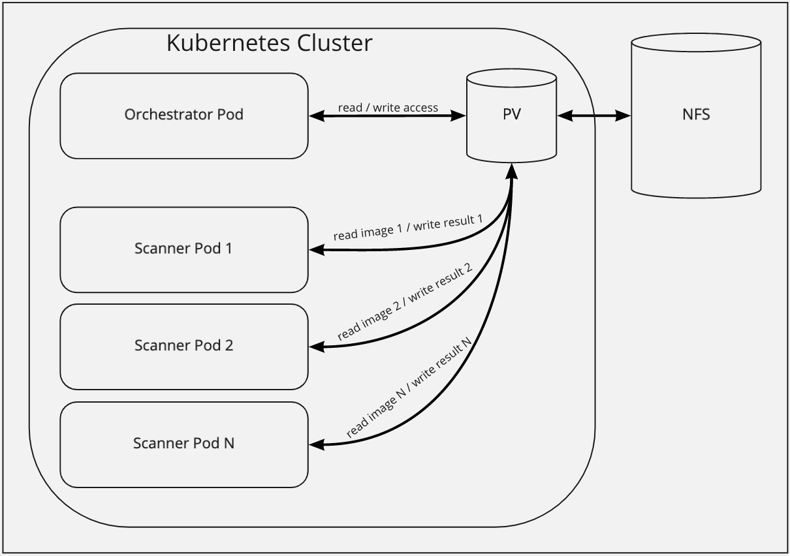

## Case Study: File Transfer

In order to scan many images with many scanners we need a way to download the images once and provide them to the different scanners. To follow the principle of least privileges the scanners should not be able to change the provided images. The ability to change images may provide an intruder a sector to hide major issues from discovering.

This case study has the following goals:
- Transfer many images from Job-Orchestrator to specific scanners
- A scanner should only 'see' the image his job is about
- A scanner can not change the image because other scanners may work with the image later on.
- One scanner gets a folder to provide scanning results for following processes, scanning results may be up to 100MB
- The result-folder can only be accessed by one single scanner and the Job-Orchestrator

To reach that goal, an option is a persistent volume with the access-mode: ReadWriteMany and the Kubernetes ability to mount only subfolders into pods. This would lead to one single PV, which is easy to handle, manage and monitor.

Market research leads us to the usage of an external NFS as PV. NFS implementations are ReadWriteMany by design and can also be bought as managed-service in cloud environments.



To build a small prototype we developed the plain-yamls to add the NFS as PV to our Kubernetes cluster.

```yaml
apiVersion: v1
kind: PersistentVolume
metadata:
  name: nfs
spec:
  capacity:
    storage: 1Gi
  accessModes:
    - ReadWriteMany
  nfs:
    server: "192.168.0.10"
    path: "/volume1/cluster"

---

apiVersion: v1
kind: PersistentVolumeClaim
metadata:
  name: nfs-pvc
spec:
  accessModes:
    - ReadWriteMany
  storageClassName: ""
  resources:
    requests:
      storage: 1Gi
``` 

This worked and added the PV to our cluster. It is important to mention that the requested storage size has no effect to the provided volume. It currently not possible to restrict the NFS-PV with Kubernetes.

The final step was to verify the combinations of the following are possible:
- Mounting the NFS-PV with more than one pod at once
- Mounting more than one subfolder with one pod
- Configure access ReadOnly/ReadWrite on subfolder-level

The following YAML created the test environment:

```yaml
apiVersion: v1
kind: Pod
metadata:
  name: main-pod
spec:
  containers:
  - name: nfs
    image: quay.io/sdase/centos-development:8
    command: ['sh', '-c', 'echo The app is running! && sleep 3600']
    resources: {}
    volumeMounts:
      - name: nfs-volume
        mountPath: "/nfs"
  volumes:
  - name: nfs-volume
    persistentVolumeClaim:
      claimName: nfs-pvc

---

apiVersion: v1
kind: Pod
metadata:
  name: restricted-pod
spec:
  containers:
  - name: nfs
    image: quay.io/sdase/centos-development:8
    command: ['sh', '-c', 'echo The app is running! && sleep 3600']
    resources: {}
    volumeMounts:
      - name: nfs-volume
        mountPath: "/nfs/read"
        subPath: read
        readOnly: true
      - name: nfs-volume
        mountPath: "/nfs/write"
        subPath: write
        readOnly: false
  volumes:
  - name: nfs-volume
    persistentVolumeClaim:
      claimName: nfs-pvc
```

The following tests were applied to the containers

    kubectl exec -it main-pod -- bash -c "echo 'added from main-pod' > /nfs/read/test.file"
    > (return code 0)

    kubectl exec -it restricted-pod -- bash -c "cat /nfs/read/test.file"
    > added from main-pod

    kubectl exec -it restricted-pod -- bash -c "echo 'should fail' > /nfs/read/test.file"
    > bash: /nfs/read/test.file: Read-only file system

    kubectl exec -it restricted-pod -- bash -c "echo 'should succeed' > /nfs/write/test.file"
    > (return code 0)

    kubectl exec -it main-pod -- bash -c "cat /nfs/write/test.file"
    > should succeed

### Success :white_check_mark: 

All tests run as expected and therefore we can use this approach to transfer data between images while following the principle of least privileges.

#### Other possible approaches:

- Another way to dynamically mount volumes to different pods could be done with the CIFS Flexvolume Plugin for Kubernetes. This would support other Network Storage Formats and dynamic mounting without PV or PVC but would need additional tools installed on all Kubernetes nodes. [Check here](https://github.com/fstab/cifs)