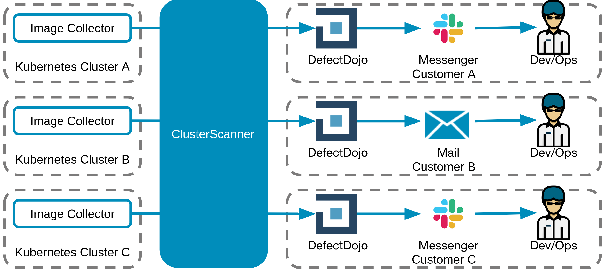
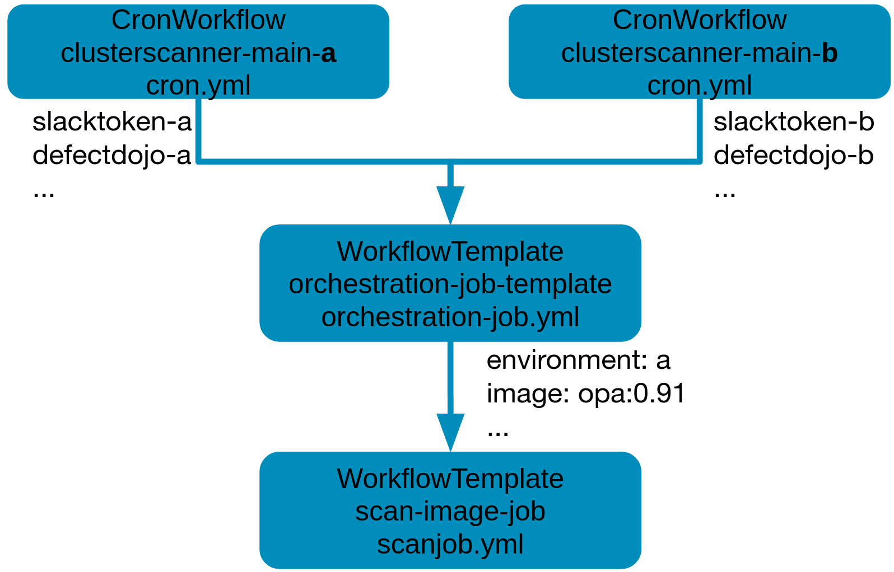

# Setup
## Requirements

Tools:

- Kubernetes
- ArgoWorkflow (ideal v3.X, minimum v2.12.11, v.2.12.5 doesn't work)

Others:

- Images to be scanned in a git repository, e.g. fetched via ClusterScanner Image Collector (might be on the same cluster as the ClusterScanner Orchestrator)
- Communication Channel (e.g. slack, email)
- S3 (with retention policy of _X_ days, e.g. 2) for artifacts
- PersistentVolumeClaim with access mode _ReadWriteMany_ (e.g. AWS EFS or nfs)

## Deployment via Helm

### Manual deployment

Add the helm repository:
```shell
helm repo add clusterscanner https://raw.githubusercontent.com/SDA-SE/cluster-image-scanner/gh-pages
```
```shell
helm install cluster-image-scanner-orchestrator-base clusterscanner-dev/cluster-image-scanner-orchestrator-base
```
No values need to be set for the base chart, but you might want to set some for tweaking purposes.

For the main chart, create a new values file and set some basic mandatory values:

```yaml
api:
  host: ""
credentials:
  apikey: ""
  signature: ""
storage:
  s3:
    bucket: ""
defectdojo:
  user: ""
  url: ""
  token: ""
dependencytrack:
  url: ""
  key: ""

scanjob:
  registryOverride:
    dockerA:
      to: ""
    dockerIo:
      to: ""
    default:
      to: ''
slack:
  cliToken: ""
```

Then, install the chart with the given values:

```shell
helm install -f values.yaml cluster-image-scanner-orchestrator clusterscanner-dev/cluster-image-scanner-orchestrator
```

### Deployment via terraform

You can use the helm charts mentioned above via terraform:

```terraform
resource "helm_release" "clusterscanner_orchestrator_base" {
  repository  = "https://raw.githubusercontent.com/SDA-SE/cluster-image-scanner/gh-pages"
  chart       = "cluster-image-scanner-orchestrator-base"
  name        = "cluster-image-scanner-orchestrator-base"
  namespace   = var.namespace
  version     = "0.1.0"
  max_history = 5
  # This is necessary because the chart creates an unmounted pvc.
  # Without this, helm would wait for the pvc to be mounted, which will never happen
  wait        = false
  values = [
    # Put your values here
    yamlencode({})
  ]
}

resource "helm_release" "clusterscanner_orchestrator" {
  repository  = "https://raw.githubusercontent.com/SDA-SE/cluster-image-scanner/gh-pages"
  chart       = "cluster-image-scanner-orchestrator"
  name        = "cluster-image-scanner-orchestrator"
  namespace   = var.namespace
  version     = "0.1.0"
  timeout     = 30
  max_history = 5
  values = [
    yamlencode({
      # put your values like above here.
    })
  ]
  depends_on = [helm_release.clusterscanner_orchestrator_base]
}
```

## ServiceAccounts
A serviceaccount _clusterscanner_ is needed. _clusterscanner_ will be used to store S3 credentials for ArgoWorkflow artifacts.

## Registry Credentials
Registry credentials can be stored as (Sealed)Secret:
```
apiVersion: bitnami.com/v1alpha1
kind: SealedSecret
metadata:
  creationTimestamp: null
  name: registry-sda-default
  namespace: clusterscanner
  labels:
    app.kubernetes.io/name: clusterscanner
spec:
  encryptedData:
    auth.json: XXXX
  template:
    metadata:
      creationTimestamp: null
      name: registry-sda-default
      namespace: clusterscanner

```
_auth.json_ will be mounted to fetch to be scanned container images from registries with authentication. It has the following format:
```
{
	"auths": {
		"quay.io": {
			"auth": "XXX"
		}
	},
	"HttpHeaders": {
		"User-Agent": "Docker-Client/18.09.5 (linux)"
	}
```
Multiple registries (identified via different hosts) can be defined.

## Persistent Volume Claims
To temporary store images, they are stored in a PVC.
Make sure to have enough space in the PVC, as all scanned images will be stored in the PVC as tar.

## Multi Tenant Deployment
By having multiple clusters (e.g. due to multiple customers):

The following figure shows the ArgoWorkflows workflow structure:


## Slack Token
In case slack is used, an app should be created. The creation of an app including "Bot Tokens" is described in the [slack app documentation](https://api.slack.com/tutorials/tracks/hello-world-bolt). The scope `chat:write` is needed. The created user needs to be invite to all channels in which the user should post messages to.
