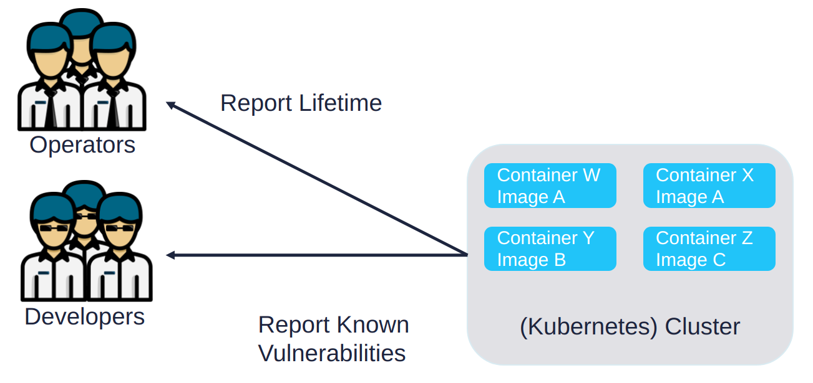
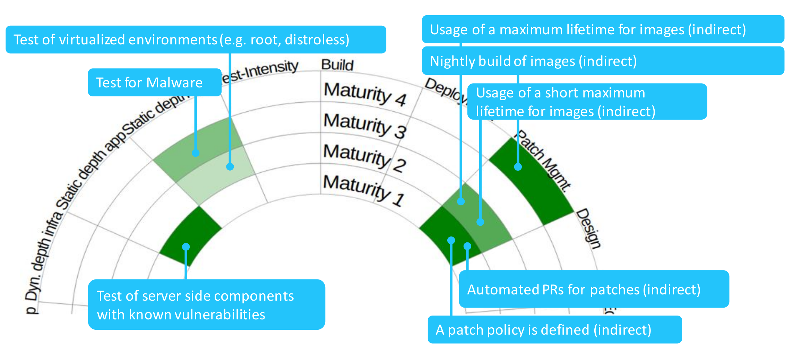

# ClusterScanner

Discover vulnerabilities and container image misconfiguration in production environments.

The ClusterImageScanner detects images in Kubernetes clusters and provides fast feedback based on security tests. It is recommended to run the Cluster Scanner in production environments.
As a developer, the Cluster Scanner works out of the box. As a system operator, I just have to add the ClusterImageScanner in my deployment configuration, for example Argo CD. The benefit is to get feedback on what is in production and not what should be in production. For example, due to waiting for approval or due to a failing build.

The use case is shown in the following figure:

An overview is depicted in the following figure:

* The Image Collector, as the name suggests, collects the different images.
* These images can be passed to the Fetcher via the Cluster Scan, via the GitOps process, or manually. The Fetcher then converts the CSV files into JSON files and provides additional fields with information about clusters, teams and images.
* These files are kept in a separate directory and from there they are passed to the scanner.
* Multiple scanner are used, e.g. Dependency Track, Lifetime, Malware and further more.
* The vulnerability management tool then collects the results and makes them available to the developers via a communication channel like Slack.

## Why using ClusterScanner
### Scanner
The various scans help to enhance the security of images. This is required by GDPR.
In addition, the ClusterScanner helps to be compliant with regulations like [DRAFT Digital Operational Resilience Act (short DORA)](https://eur-lex.europa.eu/legal-content/EN/TXT/HTML/?uri=CELEX:52020PC0595&from=EN).
Some samples of what DORA (2021-07) requires and how the ClusterScanner addresses it:
- Article 6: _[...] Financial entities shall use and maintain updated ICT systems, protocols and tools, which fulfil the following conditions [...]_ which the lifetime check addresses
- Article 7: _[...]Financial entities shall on a continuous basis identify all sources of ICT risk, in particular the risk exposure to and from other financial entities, and assess cyber threats and ICT vulnerabilities relevant to their ICT-related business functions and information assets.[...]_, which the continuously/periodically running ClusterScanner addresses

The [OWASP DevSecOps Maturity Model](https://dsomm.timo-pagel.de) provides a guideline on what security activities to perform at which organization maturity.
The ClusterScanner solves the following activities directly (via tests on the left side) and enforces indirectly that an organization or team enhances the maturity. For example enforces the lifetime check, that a defined maximum image lifetime has to be set.

See also [scans](user/scans/README.md) for details about the scans itself.

### ClusterScanner Image Collector
The _ClusterScanner Image Collector_ provides the following features:
- Version of the images in production to know what was in production in case of an incident and discovery later (compliance)
- Up to date asset inventory (like required by ISO 27001 A.8), specially by providing a brief description on namespaces
