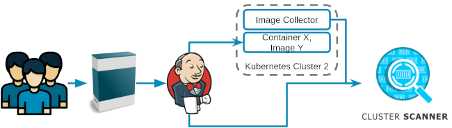

# Target Audience
Teams using the cluster scanner to get notified.

# Image Collector Configuration
## Via Annotations
To get notified about potential issues, the [ClusterScanner Image Collector](../../deployment/clusterscanner-image-collector.md) needs to be setup on the cluster.
As a team, **annotations** can be set in the following way to enable/disable scanning:

```
# Notification configuration (namespace/object)
contact.sdase.org/email: "clusterscannertest@sda.se"
contact.sdase.org/team: "the-fellowship-of-the-ring"
contact.sdase.org/slack: "#fellowship-security" # in case not set on namespace/pod: derived from as <team>-security
sdase.org/description: "My service description" # optional

# Skip scanning for an image in a namespace
clusterscanner.sdase.org/skip_regex: "^mock-service:\|^mongo:\|^openpolicyagent/opa:" # String, especially useful for development clusters with development and production components at the same cluster
clusterscanner.sdase.org/skip: "true" # Boolean, to skip all images in the namespace
clusterscanner.sdase.org/skip: "false" # Boolean,  to scan all images in the namespace, in case the default is true

# Object
## Skip scanning for all images in the pod
clusterscanner.sdase.org/skip: "true" # Boolean, specially useful for development clusters with development and production components in one namespace
clusterscanner.sdase.org.sdase.org/namespace_filter: "^ring-release$\|^ring-development$" # String, compares the current namespace with the given filter (regex)

scm.sdase.org/source_branch: "feature/foobar" # String, correspondinig source code management branch name
scm.sdase.org/source_url="https://github.com/cluster-image-scanner" # String
scm.sdase.org/release="1.0.0" # String, see also labels
  
# Adjust scans on object or namespace
clusterscanner.sdase.org/is-scan-baseimage-lifetime: "true" # Boolean
clusterscanner.sdase.org/is-scan-lifetime: "true" # Boolean
clusterscanner.sdase.org/is-scan-distroless: "true" # Boolean
clusterscanner.sdase.org/is-scan-dependency-check: "true" # Boolean
clusterscanner.sdase.org/is-scan-runasroot: "true" # Boolean
clusterscanner.sdase.org/is-scan-new-version: "true" # Boolean
clusterscanner.sdase.org/is-scan-malware: "false" # Boolean, scan to be implemented

clusterscanner.sdase.org/max-lifetime: "14" # Number, max lifetime days for the lifetime scan
```
Filters like `skip_regex` and `namespace_filter` are implemented with [grep](https://www.gnu.org/software/grep/manual/grep.html).

### ISO 27001 compliance
You might use `sdase.org/description` to describe the services in all namespaces. It will enforce an extra file `service-description.json` in the target repository. This procedure might solve parts of the ISO 27001 requirement _A.8_ to establish an asset inventory.

## Via Labels
Additionally, the following **labels** can be used:

```
app.kubernetes.io/name: "ring-calling-service" # defaults to image
app.kubernetes.io/version: "3.42.0" # defaults to image tag
```


## Sample configuration which also establishes compliance
This is a recommended configuration including ISO 27001 asset catalog compliance, in case the standards (slack channel naming and scan-configurations) are adjusted to your needs, already.

### Annotations
```
contact.sdase.org/team: "the-fellowship-of-the-ring"
sdase.org/description: "My broad application description"
```
### Labels
```
app.kubernetes.io/name: "ring-calling-application" # defaults to image
```

# Inheritance of annotations.
The inheritance of overriding the parent annotations/configuration is pointed out in the following figure:


# Non-Deployment Configuration
In case of a software development company, not all applications are self hosted. Some applications might be developed and shipped to the customer. The hosting in this case belongs to the customer.
Assuming that the customer uses the latest released application image, we would like to test it.
As a product team, there is the option to:
* Deploy the latest released application image to a cluster which is scanned
* Use a build server like Jenkins to update an image repository like depicted in the figure below

