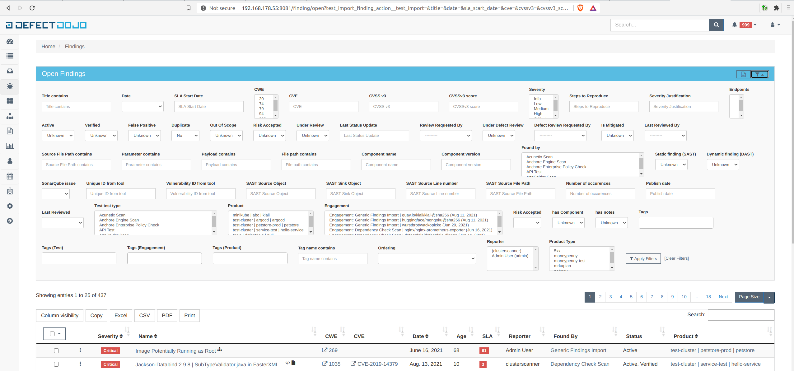
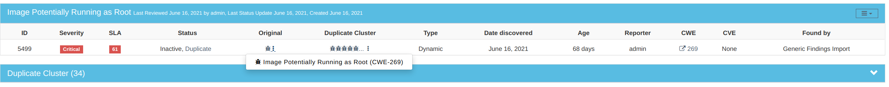

# Handling of Findings in DefectDojo

Each time the ClusterImageScanner runs, findings will be uploaded to OWASP DefectDojo.
The first time a finding is found, DefectDojo will create the finding as active.
Each time afterwards, OWASP DefectDojo detects the finding as duplicate and creates a references.

# Filter for active findings
## Open Findings View
To accept a finding or to mark it as false positive, the first active finding must be chosen.

To handle all open findings, go to "Findings" -> "Open Findings" and filter for non duplicates like:

## Finding View
In case you are in the finding view at a duplicate, click on original and handle the original finding.

