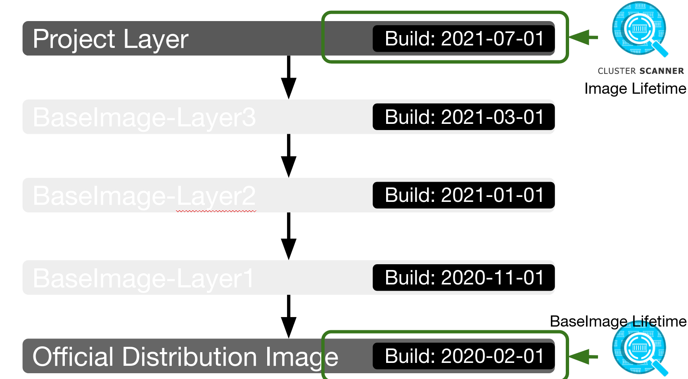

# Scan Image Lifetime
The image lifetime scan has the implication that the respective container image should only run for a certain period of time (e.g. 5 days) in the cluster, otherwise libraries contained in the image might be outdated.

## Relevance
The lifetime scan is used as an indicator for missing patch management. So that no image runs too long without updated components being included in the images. 
By using an update to date base image, it minimizes the potential vulnerabilities, since a newly build image is up to date with the latest software components.

Container images consists of:
- Application and the application dependencies
- Operating system packages

The creation date of the first layer is used for the Image Lifetime Scan:

## Response
Use the following threat treatments on issues:

### Avoidance
Do not use the image in production.

### Mitigation
In case the scanned container image exceeds the specified period of time, it is urged to create and deploy a new container image. The creation of a new container image reduces the risk of having outdated software with vulnerabilities in operation.

In case the image is a third party image, consider to build the image on your own and using the latest available application/service version.

### Acceptance
The runtime of the image over the recommended time span cannot have any comprehensible reasons. Even if the application contained in the image has not been updated at all, it is recommended to start a new image build after the maximum allowed time period.

Hint: The maximum defined lifetime your team agreed on can be configured.

### False Positive
A false positive case would only occur if the number of days was incorrect. Since the scan does not assume that this can happen, a possible action can be neglected.
